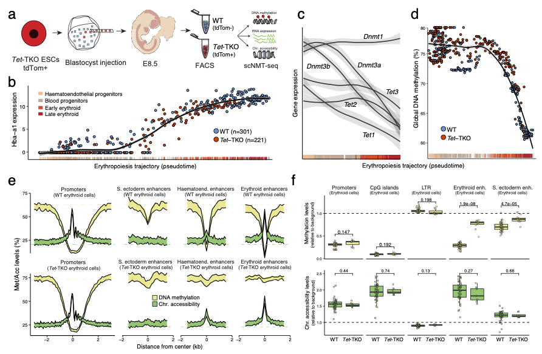

# Single-cell multi-omics profiling links dynamic DNA methylation to cell fate decisions during early mammalian organogenesis

This repository contains the scripts to reproduce the Tet-TKO scNMT-seq analysis of [the manuscript](XXX). It covers Figure 4 as well as Supplementary Figures 7-8.
The source code for the Tet-TKO scNMT-seq, is available in [this repository](https://github.com/rargelaguet/scnmt_gastrulation_TetChimera)

 

Experimental design
--------
We generated TET1/2/3 -/- (Tet-TKO) chimeric embryos following the study design of [Pijuan-Sala et al 2019](https://www.nature.com/articles/s41586-019-0933-9), in which Tet-TKO cells are marked by the fluorescent marker tdTomato thereby allowing collection of two fractions using FACS: a fluorescent fraction that contains Tet-TKO cells and a non-fluorescent fraction that contains WT host cells. We additionally use antibody staining to enrich for cells belonging to the primitive erythropoiesis trajectory. Single cells were collected and processed using [scNMT-seq](https://doi.org/10.1038%2Fs41467-018-03149-4) which profiles chromatin accessibility, DNA methylation and RNA transcription in parallel from the same cell. 

Key results
--------

- We find that primitive erythrocytes are associated with global methylation loss, independent of TET enzymes, likely mirroring the demethylation that occurs later in development during [definitive erythropoiesis](https://doi.org/10.1126%2Fscience.1207306).

- Beyond this passive process, we discover coordinated demethylation of  distal regulatory elements associated within the blood lineage that is TET-dependent and which provides a molecular explanation for the depletion of erythrocytes in Tet-TKO.

- We further show that TET-dependent demethylation of distal regulatory elements is a common feature of differentiation during early organogenesis.

Data
-------
Raw data is available at [GEO](https://www.ncbi.nlm.nih.gov/geo/query/acc.cgi?acc=GSE204908).
Parsed data can be downloaded in progress....

<!-- The raw data is accessible at GEO ([GSEXXXX](XXXX)). 
The parsed data can be downloaded [here](XXXX) -->

Shiny app
--------
We provide a shiny app that allows the user to explore the Tet-TKO scRNA-seq results [here](https://www.bioinformatics.babraham.ac.uk/shiny/tet_ko_embryo_scrna/). Note that we currently do not have a shiny app to explore the scNMT-seq TET-TKO results.

Contact
-------

For questions on the computational analysis: Ricard Argelaguet (ricard.argelaguet@gmail.com). For questions on the experimental work: Tim Lohoff (tlohoff431@gmail.com) or Stephen Clark (Stephen.Clark@babraham.ac.uk)

